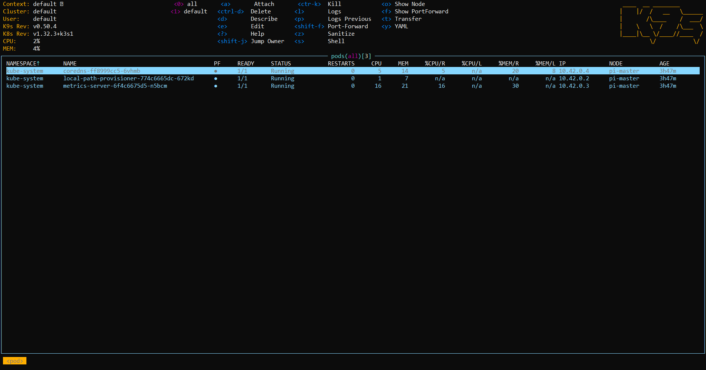

# Initial Cluster Set Up
_Note:_ Update 192.168.1.0 to local network address for all relevent commands.
## Laptop Setup - using WSL on Windows:
Grab the following software:

#### SD card formatter:
- While your default OS works in a pinch, using the SD Formatter is safer if you're preparing a card for something more than basic file storage.
https://www.sdcard.org/downloads/formatter/

#### Rasberry Pi imager:
- For writting the rasberry pi OS to the SD card
https://www.raspberrypi.com/software/

#### Rasberry Pi OS image:
- Select raspios_lite_arm64-2024-11-19/ this will be updated as new OS become availible, but just in case any braking changes are introduced pick this one.
https://downloads.raspberrypi.com/raspios_lite_arm64/images/

#### WSL
Get Windows Substack for Linux (WSL):
- Open PowerShell or Windows Command Prompt in administrator mode by right-clicking and selecting "Run as administrator" & run

`wsl --install`

Official guide is here:
WSL https://learn.microsoft.com/en-us/windows/wsl/install

#### Write SD's
- Use SD card formater to format each SD card.
- Using Raspberry Pi Imager install the OS, set unique hostnames for each, I've used: pi-master, pi-node-1 for 2 Pi's.
- On WSL terminal run `sudo apt  install nmap`
- `nmap -sn 192.168.1.0/24` to list connected devices, make note - will see new ones once pi's connected.
- Plug in Pi's wait a min

## Pi Setup
### Set Fixed IP, Disable Swap & cgroup configuration:
In Your WSL terminal:
- `nmap -sn 192.168.1.0/24` - will have two new ones. SSH into them do the following FOR EACH DEVICE UPDATING LAST PART OF ADDRESS (85 in this case):

	- `nmcli connection show`

	- Look for something like 'Wired connection 1' under the "NAME" column for Ethernet (eth0) or "preconfigured" (wifi)

    ### To Set fixed IP:
    `sudo nmcli connection modify "preconfigured" ipv4.addresses 192.168.1.85/24`

	`sudo nmcli connection modify "preconfigured" ipv4.gateway 192.168.1.1`

	`sudo nmcli connection modify "preconfigured" ipv4.dns 192.168.1.1`

	`sudo nmcli connection modify "preconfigured" ipv4.method manual`
		
	### Disable Swap:
	we need to disable swap as K8s deals with this so:
	- Turn off swap temporarily. `sudo swapoff -a`

    - To turn of swap permanently we need to update the`CONF_SWAPSIZE` in `dphys-swapfile` file to `0`
    
    - run:
	
        `sudo nano /etc/dphys-swapfile`
    
    - and set

	    `CONF_SWAPSIZE=0`

        ctrl + x and save the changes.
		
	### CGROUPS:
	- Open the cmdline.txt file

	    `sudo nano /boot/firmware/cmdline.txt`
		
	- Add below into THE END of the current line

	    `cgroup_enable=cpuset cgroup_memory=1 cgroup_enable=memory`
		
        ctrl + x and save the changes.
	
    ### Reboot for changes to take effect
    `sudo reboot`

    ### Validate
    Once the above steps have been carried out on each device	
	- `nmap -sn 192.168.1.0/24` - you should see the new set addresses.

    ## Master Node Setup
	- SSH in to your master node I've set as pi-master located at 192.168.1.85 (update to yours in command) and run:

        `curl -sfL https://get.k3s.io | INSTALL_K3S_EXEC="server --disable=traefik --flannel-backend=host-gw --tls-san=192.168.1.85 --bind-address=192.168.1.85 --advertise-address=192.168.1.85 --node-ip=192.168.1.85 --cluster-init" sh -s -`

	- check status of cluster: `sudo k3s kubectl get nodes`
	
    - for authenticating the worker nodes we need to get node-token from master node

	    `sudo cat /var/lib/rancher/k3s/server/node-token`
		
	    The result is something likes this copy paste it to your clipboard.
		`THIS19937008cbde678aeaf200517f07c0ccd67dc80bdf4df6f746IS4780e15ebcd::server:40fc2cc2fnode81cdacc0b9bb1231token`

    ## Worker Node Setup:
	- Upon retrieval of the node token, it is necessary to inject it into the script shown below. This script should be executed on all the Pi nodes specified previously. Please ensure to update the IP address associated with K3S_URL, as required.
    - SSH into each worker node and:

        `curl -sfL https://get.k3s.io | K3S_URL=https://192.168.1.85:6443 \
  K3S_TOKEN="K1005fdbf0aaf96e813f52e92f27c6a34b363660cb337aef73d9e2f767ccd211ac2::server:1de04fc65d476d9b8700e78d3e086801" sh -`
	
    - return to master node and check all nodes running and connected:

	    `sudo k3s kubectl get nodes`

    - Should looks something like:

        | NAME       | STATUS | ROLES                      | AGE |      VERSION         |
        |------------|--------|----------------------------|-----|      -----------------|
        | pi-master  | Ready  | control-plane,etcd,master  | 17m | v1.32.3      +k3s1     |
        | pi-node-1  | Ready  | none                     | 95s | v1.32.3      +k3s1     |

## Configure Access And Monitoring from Laptop (In Windows WSL)
- Copy kubeconfig back to laptop so can interact remotley with cluster, make sure in home dir with `cd ~/`
- create local dir to store

	`mkdir -p ~/.kube`
	
- Copy kubeconfig to the dir we just created
	
    `ssh scott@192.168.1.85 "sudo cat /etc/rancher/k3s/k3s.yaml" > ~/.kube/config`
	
- Check & Update the IP inside the file if required

    `sudo nano ~/.kube/config`
	
    find the line `server: https://127.0.0.1:6443`
	
    change it to `server: https://192.168.1.85:6443` (if it isn't already)
	
- Install kubectl **You must use a kubectl version that is within one minor version difference of your cluster. For example, a v1.33 client can communicate with v1.32, v1.33, and v1.34 control planes**

	`sudo apt update`

	`sudo apt install -y curl`

	`curl -LO "https://dl.k8s.io/release/$(curl -L -s https://dl.k8s.io/release/stable.txt)/bin/linux/amd64/kubectl"
	sudo install -o root -g root -m 0755 kubectl /usr/local/bin/kubectl`

	``kubectl version --client`` should show version if succsessfull
	
	- Validate kubctr can connect to cluster:
	
    `kubectl get nodes`

    I get:
    
    | NAME       | STATUS | ROLES                      | AGE |  VERSION        |
    |------------|--------|----------------------------|-----|  ----------------|
    | pi-master  | Ready  | control-plane,etcd,master  | 43m | v1.32.3  +k3s1   |
    | pi-node-1  | Ready  | <none>                     | 27m | v1.32.3  +k3s1   |

	
- If nodes have ROLE <none> then you can set them as workers (replacing names) with:

	`kubectl label nodes pi-node-1 node-role.kubernetes.io/worker=`

	
### Setup Cluster monitoring (K9s)
- Check latest version https://github.com/derailed/k9s/releases
- Download replacing version number

    `wget https://github.com/derailed/k9s/releases/download/v0.50.4/k9s_linux_amd64.deb`

- Now install

    `sudo apt install ./k9s_linux_amd64.deb`

- Open WSL terminal and run `k9s`
You should see something similar to:

## Reference Material:
- Updated for variations from https://medium.com/@stevenhoang/step-by-step-guide-installing-k3s-on-a-raspberry-pi-4-cluster-8c12243800b9
- https://kubernetes.io/docs/tasks/tools/install-kubectl-linux/
- https://github.com/derailed/k9s/releases